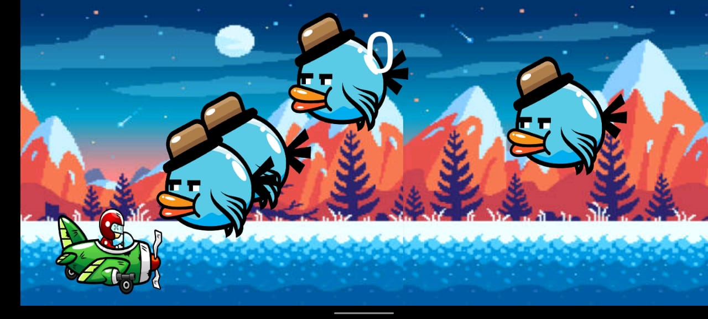
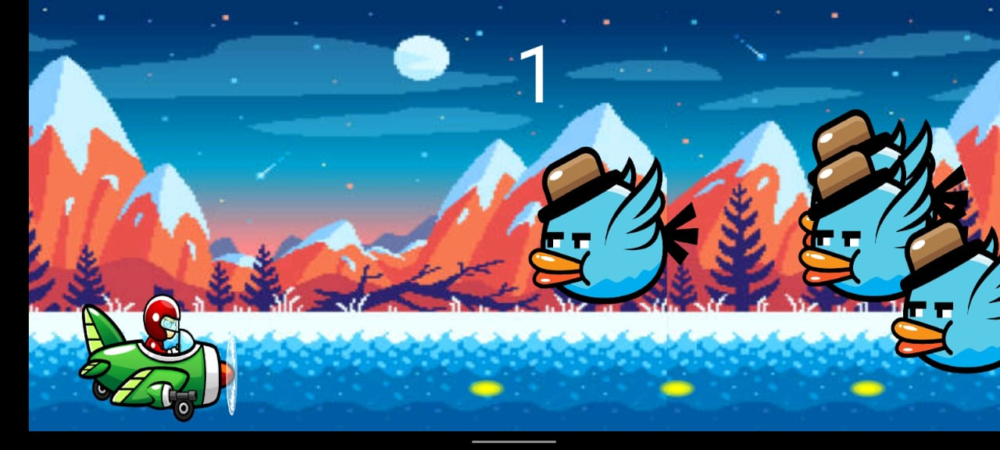

Fly High is a simple and addictive 2D mobile game that challenges players' reflexes and coordination. The objective of the game is to navigate a player through air by tapping the screen, avoiding collisions. The game features retro-style graphics and an easy-to-understand gameplay mechanic, making it suitable for players of all ages.

## How to Play
1. Tap the screen to make the player fly upward.
2. Release the tap to let the player fall naturally.
3. Navigate the player through Sky.
4. Each successful passage through a set of birds earns the player one point.
5. The game ends if the player collides with the bird.

## Features
1. Easy controls
2. high scores
3. global leaderboard
4. nostalgic sounds
5. endless fun
6. social sharing! 

## UI

